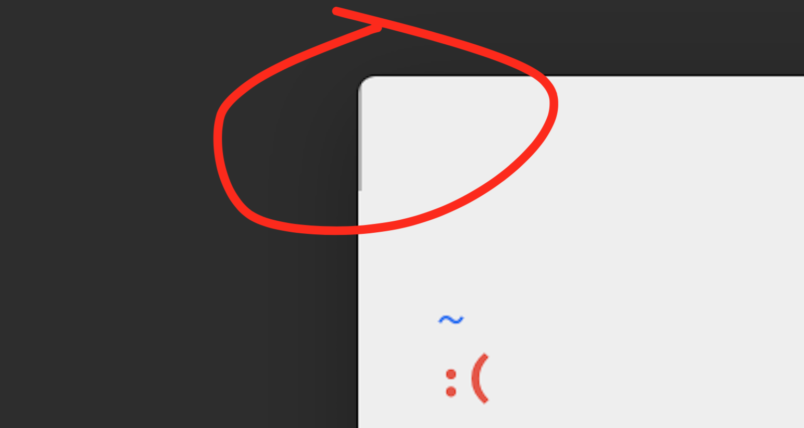
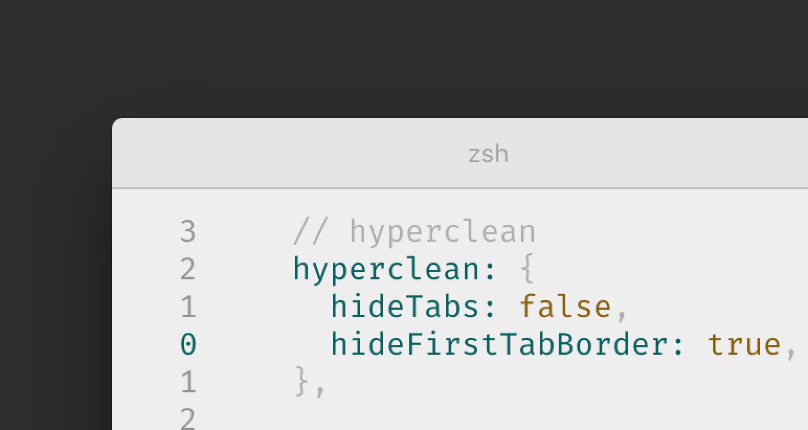

# hyperclean

> Remove traffic-lights from your windows


## Configuration

In your `~/.hyperterm.js`, you can configure settings for `hyperclean`.

```js
modules.exports = {
  config: {
    // other config...
    hyperClean: {
      hideTabs: true, // default: false
      hideFirstTabBorder: true, // default: false
    },
  },
  // ...
};
```

### hideTabs

Change The visibility of the tabs.


### hideFirstTabBorder

Hide the border of the first tab.




